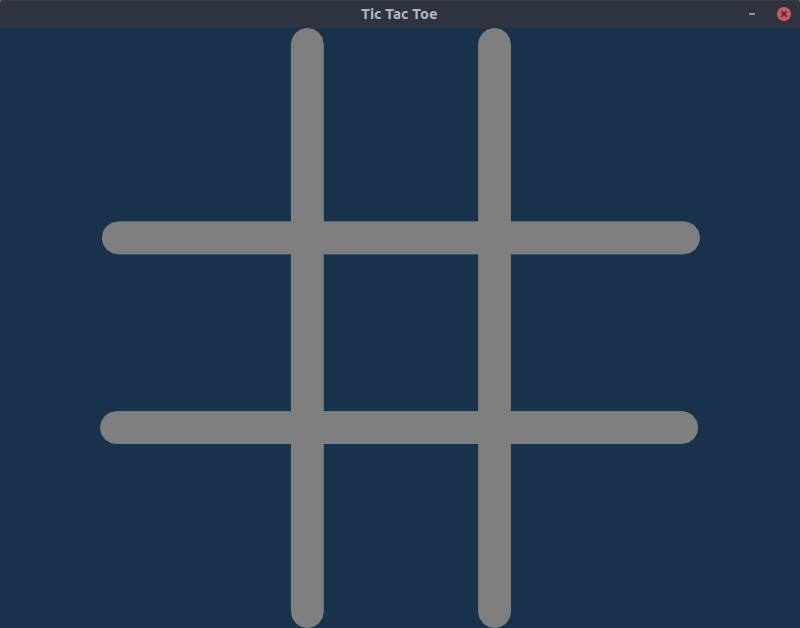
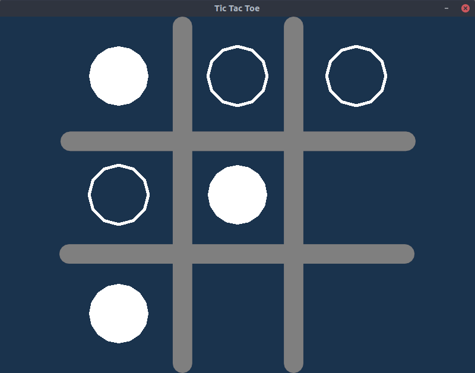
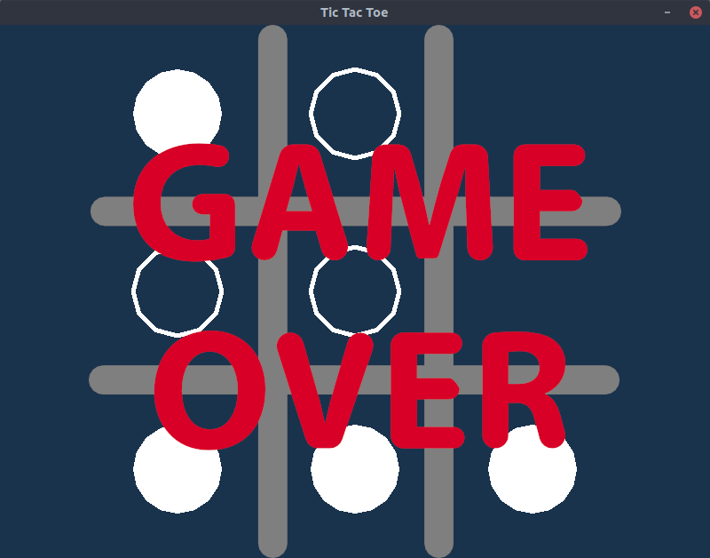

# grachical-tic-tac-toe

A graphical tic-tac-toe game written in Rust and [ggez](https://crates.io/crates/ggez)

## Requirements
1. Rust and cargo should be [installed](https://www.rust-lang.org/en-US/install.html)
2. Install [SDL2 libraries](https://github.com/Rust-SDL2/rust-sdl2#requirements)

### Use cargo run in the project dictionary to run the game

